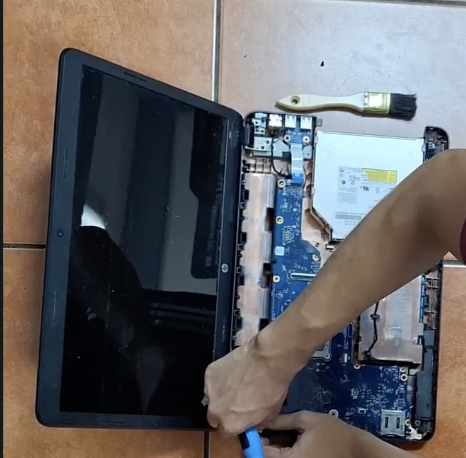
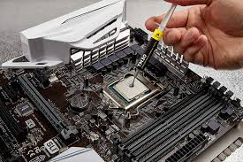

# Manual para dar mantenimiento a tu computadora (Grupo 4)

---

## Software

Mantén tu computador libre de archivos innecesarios y protegido de virus con estas recomendaciones:

1. Elimina programas que no usas.  
2. Usa un antivirus confiable como **Malwarebytes** para mantener protegida tu computadora.  
3. Mantén el sistema y programas actualizados.  
4. No descargues archivos de páginas sospechosas.

**Tip extra**: Realiza copias de seguridad de tus archivos importantes.

---

## Hardware

Sigue esta guía rápida para limpiar el hardware:

1. Quita todos los tornillos visibles y destapa tu computador.  
   Puedes tomar una **foto o video** antes de desarmarla para asegurar dejar todo como estaba.
2. Con un pincel, sacude la placa madre y los disipadores de calor para limpiar todo el polvo que pueda haber.  
   
3. En caso de haber derramado algún líquido como café o jugos, puedes limpiar la motherboard usando **alcohol isopropílico al 90% o superior** (idealmente 99%).  
   No uses alcohol común (etanol de farmacia) ni mezclas con agua, ya que pueden dejar residuos y provocar corrosión.
4. Retira las tarjetas **SSD** y limpia los chips con un borrador.
5. Aplica pasta térmica a tu procesador.  
   
6. Vuelve a colocar todo en su lugar usando el video o fotos de referencia.

---

**Recomendación final**  
Asegúrate de darle mantenimiento **al menos una vez al mes** para mejorar el rendimiento de tu computador.
